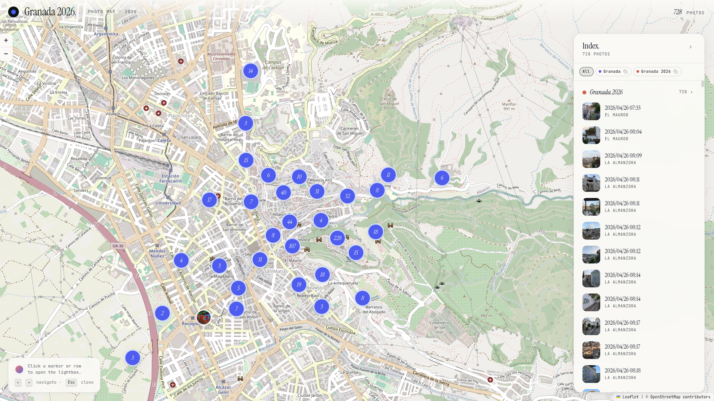

# PhotoMap

PhotoMap turns folders of geotagged travel photos into an interactive static map and gallery. It extracts EXIF/GPS metadata, optionally reverse-geocodes locations, generates thumbnails and resized images, and produces a deployable static site with no application server required.

**Live demo:** [Granada 2026](http://www.freya-gnam.de/photomap/)

[](http://www.freya-gnam.de/photomap/)

The project is designed for a simple workflow: organise photos by trip, run one build command, and publish the generated `dist/` directory to any static host.

## What it does

- interactive Leaflet map with marker clustering;
- OpenStreetMap raster basemap with no application API key required;
- trip-based grouping and filtering;
- virtualised sidebar suitable for large photo collections;
- keyboard-navigable lightbox with thumbnail strip;
- EXIF/GPS extraction and cached reverse geocoding via OpenStreetMap Nominatim;
- incremental thumbnail and resized-image generation;
- shareable `?trip=slug` links;
- local Python build or containerised build;
- optional FTP/FTPS deployment.

## Quick start

Requirements: Python 3.9+.

```bash
git clone https://github.com/fgna/photomap.git
cd photomap
python3 -m venv .venv
source .venv/bin/activate
pip install -r requirements.txt

mkdir -p trips/paris-2024
cp ~/Photos/paris/*.jpg trips/paris-2024/

python3 build.py
python3 -m http.server -d dist 8080
```

Then open `http://localhost:8080`.

Create one subfolder inside `trips/` for each trip. The folder name becomes the trip label; hyphens and underscores are converted to spaces.

```text
trips/
  paris-2024/
    IMG_0001.jpg
    IMG_0002.jpg
  iceland-2023/
    IMG_1234.heic
```

Supported formats: **JPG · JPEG · WebP · PNG · HEIC · TIFF**.

HEIC support requires the optional `pillow-heif` dependency noted in `requirements.txt`.

## Docker

The repository includes a Dockerfile and a GitHub Actions workflow. Pull requests build the image as a validation step. Version tags matching `v*` build and publish an image to GitHub Container Registry.

For a published release tag, use the corresponding tag from `ghcr.io/fgna/photomap`:

```bash
docker pull ghcr.io/fgna/photomap:vX.Y.Z

docker run --rm \
  -v /path/to/trips:/photomap/trips \
  -v /path/to/dist:/photomap/dist \
  ghcr.io/fgna/photomap:vX.Y.Z
```

To persist the geocoding/cache data across builds, create the file before mounting it:

```bash
touch /path/to/build-cache.json

docker run --rm \
  -v /path/to/trips:/photomap/trips \
  -v /path/to/dist:/photomap/dist \
  -v /path/to/build-cache.json:/photomap/build-cache.json \
  ghcr.io/fgna/photomap:vX.Y.Z
```

If the cache path does not exist before the mount, Docker may create a directory at that path instead of a file.

## Build output

Running `python3 build.py` creates a self-contained `dist/` directory:

```text
dist/
  index.html
  trips/
    paris-2024/
      .thumbnails/
      .resized/
```

Deploy the complete `dist/` directory to any static host such as GitHub Pages, Netlify, S3, Nginx or Apache.

The build is incremental: unchanged photos reuse existing generated images and cached metadata. `build-cache.json` stores EXIF/geocoding results and is intentionally ignored by Git.

## Build options

```text
python3 build.py [options]

  --trips-dir PATH    Source trips directory          (default: ./trips)
  --output PATH       Output directory                (default: ./dist)
  --title TEXT        Site title                      (default: "Photo Map")
  --no-geocode        Skip Nominatim reverse geocoding
  --retry-geocode     Retry previously failed geocoding results
  --force-thumbs      Regenerate all thumbnails
  --cache PATH        EXIF + geocoding cache          (default: ./build-cache.json)
  --assets PATH       Directory with style.css/app.js (default: ./assets)
```

## Reverse geocoding

GPS coordinates can be reverse-geocoded at build time using OpenStreetMap Nominatim. Results are baked into the generated site.

- requests are rate-limited to one per second;
- successful results are cached in `build-cache.json`;
- failed lookups are normally retried after 24 hours;
- `--retry-geocode` immediately retries only previously failed lookups while preserving successful cached names;
- retrying geocoding does not force thumbnail or resized-image regeneration;
- the build summary reports how many GPS photos have named vs unresolved locations;
- `--no-geocode` disables network geocoding entirely.

Example:

```bash
python3 build.py --title "Granada 2026" --retry-geocode
```

When publishing a generated site, remember that geotagged photos can reveal precise travel locations. Review the photos and location data you intend to make public.

## FTP / FTPS deployment

PhotoMap can optionally upload `dist/` after a successful build:

```bash
python3 build.py --ftp-host ftp.example.com --ftp-user myuser --ftp-dir /public_html
```

The password is prompted securely when omitted. For automation, use the `FTP_PASSWORD` environment variable rather than committing credentials:

```bash
FTP_PASSWORD=secret python3 build.py \
  --ftp-host ftp.example.com \
  --ftp-user myuser \
  --ftp-dir /public_html \
  --ftp-tls
```

## Project status

PhotoMap is a finished personal tool with a published Granada 2026 live demo and is maintained conservatively. The repository is public primarily as a reusable utility and portfolio project; new work is tracked through GitHub issues when a real need appears.

## License

PhotoMap is available under the MIT License. See `LICENSE`.
